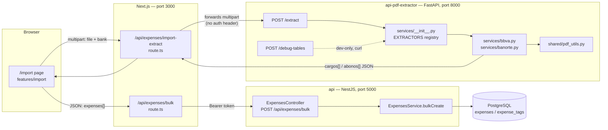
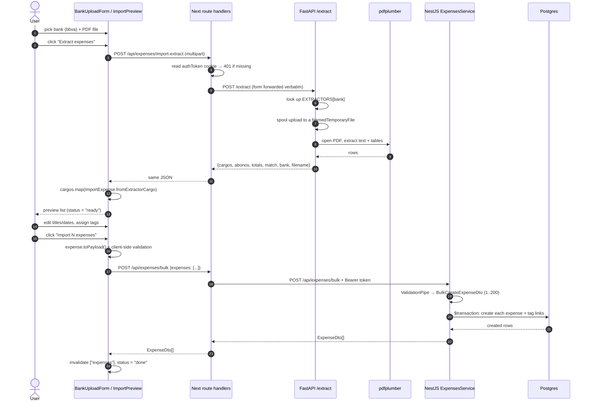
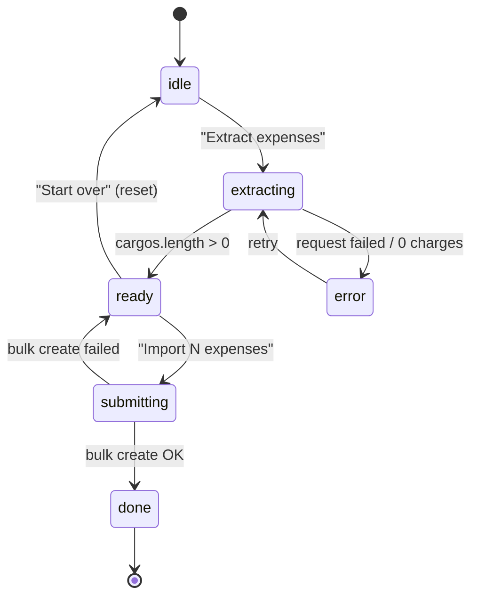
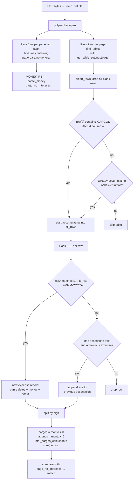

# PDF Statement Import — Flow Map & Technical Report

How a bank statement PDF becomes rows in the `expenses` table.

This document covers the `api-pdf-extractor` service (FastAPI/Python), the parts of the
NestJS `api` it feeds, and the Next.js proxy + UI that glue them together.

- **Scope:** `apps/api-pdf-extractor`, `apps/api/src/expenses`, `apps/web/src/features/import`
- **Entry point for the user:** `/import` page in the web app
- **Registered banks:** `bbva` (tuned) and `banorte` (registered, still using
  BBVA-derived settings — being tuned against real statements)

---

## 1. System map

Three independent processes, one Postgres database. The browser never talks to
either backend directly — every call goes through a Next.js route handler that
holds the `authToken` httpOnly cookie.



**Ports & env vars**

| Service | Port | Configured by |
| --- | --- | --- |
| web (Next.js) | 3000 | — |
| api (NestJS) | 5000 | `PORT` in `apps/api/.env` (falls back to 3000) |
| api-pdf-extractor (FastAPI) | 8000 | hard-coded in `scripts/run.mjs` |
| Next → extractor | — | `PDF_EXTRACTOR_URL`, default `http://localhost:8000` |
| Next → NestJS | — | `API_URL`, default `http://localhost:5000/api` |

`pnpm dev` (root) runs `scripts/dev.mjs`: it verifies Docker, starts/waits for the
`spend-track-db` container, then launches api + web + pdf under `concurrently`.
The extractor alone: `pnpm pdf setup` once (creates `.venv`, installs
`requirements.txt`), then `pnpm dev:pdf`.

---

## 2. End-to-end flow



### State machine of the import UI

The whole page is driven by one Zustand store (`features/import/stores/import.store.ts`),
scoped per-page by `ImportStoreProvider`.



`page.tsx` renders `BankUploadForm` for `idle`/`extracting`/`error`,
`ImportPreview` for `ready`/`submitting`, and `ImportSuccess` for `done`.

---

## 3. The extractor service (`apps/api-pdf-extractor`)

### Layout

```
main.py                     FastAPI app; mounts routers; GET / health check
app/routers/extract.py      POST /extract        — the production endpoint
app/routers/debug.py        POST /debug-tables   — dev tool, renders table bboxes
app/services/__init__.py    BankExtractor registry keyed by bank id
app/services/bbva.py        BBVA table settings + parser
app/services/banorte.py     Banorte table settings + parser
app/shared/pdf_utils.py     regexes, row cleanup, money/date parsing
scripts/run.mjs             cross-platform venv launcher (setup | dev | start)
```

### Adding a bank

Each bank module owns both its table geometry and its parser, because statement
layouts differ in how they draw (or don't draw) the transaction grid:

```python
@dataclass(frozen=True)
class BankExtractor:
    extract: Callable[[str], dict]
    get_table_settings: Callable[[Page], dict]
```

1. Write `app/services/<bank>.py` exporting `get_table_settings(page) -> dict`
   and `extract(pdf_path) -> dict`.
2. Register it in `EXTRACTORS` in `app/services/__init__.py`.
3. Flip the bank to `enabled: true` in
   `features/import/types/import.types.ts` (`SUPPORTED_BANKS`). The `id` must
   match the registry key and must be lowercase.

No router changes — the registry is the only dispatch point, and both `/extract`
and `/debug-tables` resolve the bank through it.

### `POST /extract`

Request: `multipart/form-data` with `file` (the PDF) and `bank` (string, lowercased).

Response (success):

```jsonc
{
  "pago_para_no_generar_intereses": 12345.67, // amount printed on the statement, or null
  "total_cargos_calculado": 12345.67,         // sum of positive amounts we parsed
  "match": true,                              // the two agree; null if the printed value wasn't found
  "num_cargos": 42,
  "num_abonos": 3,
  "cargos": [ /* positive amounts — charges */ ],
  "abonos": [ /* negative amounts — credits/payments */ ],
  "bank": "bbva",
  "filename": "estado-cuenta.pdf"
}
```

Each entry in `cargos`/`abonos`:

```jsonc
{
  "fecha_operacion": "14-ENE-2026",
  "fecha_operacion_iso": "2026-01-14",  // null if unparseable
  "fecha_cargo": "16-ENE-2026",
  "fecha_cargo_iso": "2026-01-16",
  "descripcion": "OXXO SUC 1234\nCDMX",  // may contain \n from continuation rows
  "monto": 249.9,                        // float, negative for abonos
  "monto_cents": 24990,                  // integer cents — what the UI actually uses
  "monto_raw": "$249.90"
}
```

`match` is the built-in sanity check: if the sum of parsed charges equals the
"pago para no generar intereses" figure printed on the statement, the parse is
almost certainly complete. It is computed but **not currently surfaced in the UI**.

### The BBVA parsing pipeline



**Why the table settings look the way they do** (`bbva.get_table_settings`):

```python
{
  "vertical_strategy": "explicit",
  "horizontal_strategy": "text",
  "explicit_vertical_lines": page.curves + page.edges,
  "intersection_tolerance": 15,
  "snap_y_tolerance": 5,
}
```

BBVA statements draw column separators as vector graphics but do **not** draw row
lines — rows are implied by text baselines. So columns come from the page's actual
drawn geometry (`curves + edges`) and rows are inferred from text positions. The
tolerances absorb the small misalignments in the rendered PDF.

**Multi-line descriptions.** A charge whose merchant text wraps produces a row with
no date in column 0. Those rows are folded into the previous record's `descripcion`
with a `\n` separator (`bbva.py:57-58`), which is why descriptions can be multi-line.

**Money and dates** (`pdf_utils.py`):
- `parse_money` strips `$`, `,` and spaces, returns `float | None`.
- `parse_money_cents` rounds to integer cents — this is what the UI consumes, so
  the float never reaches the database.
- `parse_date_to_iso` maps Spanish month abbreviations (`ENE`…`DIC`) to a
  `YYYY-MM-DD` string. Deliberately date-only and timezone-free, so the browser
  can't shift it a day via UTC conversion.

### `POST /debug-tables` (development aid)

Takes a PDF and a `bank` (same ids as `/extract`; an unknown one gets a 400).
It resolves that bank's `get_table_settings` and renders **exactly the tables
that bank's `extract` will iterate over** — page at 150 dpi, table bbox in red,
every cell in blue, written to `debug-images/page{N}_table{M}.png` **relative to
the process working directory**. The JSON response carries each table's bbox,
`num_columns`, `num_rows` and the raw cleaned rows.

This is the tuning loop for a new bank: point it at a sample statement, look at
the PNGs, and adjust that bank's `get_table_settings` until the blue cells line
up with the transaction grid. It clears previous `*.png` on each call, and it is
not used by the web app at all.

---

## 4. How the NestJS API receives the import

The extractor never touches the database. Persistence goes through the ordinary
expenses endpoint.

### Request path

`POST /api/expenses/bulk` → `ExpensesController.bulkCreate` → `ExpensesService.bulkCreate`

- **Auth:** `JwtAuthGuard` is registered globally via `APP_GUARD` in `AuthModule`,
  so the route is protected unless marked with the `@IsPublicRoute()` decorator.
  The user id comes from the JWT payload's `sub` through `@CurrentUser()` — the
  client cannot choose which user owns the imported expenses.
- **Validation:** the global `ValidationPipe` (`whitelist: true`,
  `forbidNonWhitelisted: true`) validates `BulkCreateExpenseDto`:
  `expenses` must be an array of 1–200 `CreateExpenseDto`, each with a positive
  `total` (max 2 decimals), a `Date` `expensedAt`, a 1–100 char `title`, and
  optional `description` (≤256) / `tagIds`.
- **Persistence:** all rows are created inside a single `prisma.$transaction`,
  each with its `ExpenseTags` join rows. A single bad row rolls the whole import
  back — an import is all-or-nothing.
- **Storage unit:** `fromDecimalToCents(total)` converts to the `totalCents`
  integer column. `expensedAt` is a Postgres `DATE`, matching the date-only
  string the extractor emits.

### Payload mapping

The `ImportExpense` domain class (`features/import/domain/import-expense.ts`) is
the translation layer between the extractor's Spanish, cents-based shape and the
API's DTO:

| Extractor field | `ImportExpense` | `CreateExpensePayload` | Notes |
| --- | --- | --- | --- |
| `descripcion` | `title` | `title` | whitespace collapsed, truncated to 100 |
| `descripcion` | `descripcion` | `description` | only sent when it differs from the title; truncated to 256 |
| `monto_cents` | `totalCents` | `total` | divided by 100 back to a decimal for the DTO |
| `fecha_operacion_iso` | `expensedAt` | `expensedAt` | `YYYY-MM-DD` |
| — | `tagIds` | `tagIds` | chosen by the user in the preview, omitted when empty |

`ImportExpense` is immutable — `withTitle`, `withDate`, `withTags` and `toggleTag`
all return new instances, which is what lets the Zustand store update by
replacement rather than mutation. Empty descriptions fall back to the title
`"Untitled charge"`.

Before submitting, `ImportPreview.handleImport` rejects the batch client-side if
any row lacks a date or has a non-positive total — mirroring the DTO rules so the
user gets an inline message instead of a 400.

---

## 5. Security & trust boundaries

| Boundary | Behaviour |
| --- | --- |
| Browser → Next.js | `authToken` httpOnly cookie; never readable by client JS |
| Next.js → extractor | **No authentication.** The route handler checks the cookie and returns 401 without it, so the proxy is the only gate. The extractor itself will parse a PDF for anyone who can reach port 8000 |
| Next.js → NestJS | `Authorization: Bearer <token>` injected server-side |
| NestJS → DB | user id taken from the verified JWT, never from the body |

The extractor is stateless with respect to user data: it holds no database
connection, no credentials, and returns everything in the response body. That
keeps its blast radius small — but it must not be exposed publicly as-is.

---

## 6. Known gaps and rough edges

Observations from reading the current code, not a work plan:

1. **Temp files are never cleaned up.** Both routers spool uploads with
   `NamedTemporaryFile(delete=False, ...)` and never `unlink` the path
   (`extract.py:18-20`, `debug.py:32-34`). Every request leaves a PDF in the
   system temp directory.
2. **`/extract` signals an unsupported bank with HTTP 200.** `extract.py:16`
   returns `{"error": "Unsupported bank..."}` with a 200 status; the web client
   compensates by checking `data.error` explicitly (`import.api.ts:29-32`).
   `/debug-tables` raises a proper 400 instead, so the two endpoints disagree —
   changing `/extract` to match would need `import.api.ts` updated in the same
   pass, since FastAPI's `HTTPException` body is `{"detail": ...}`.
3. **No upload constraints.** Content-type, file size and page count are
   unchecked; a large or malformed PDF is handed straight to pdfplumber, and
   parsing happens inline on the request (no worker/timeout).
4. **`abonos` are discarded.** The extractor returns credits and payments, but
   `BankUploadForm` only maps `result.cargos`. Negative amounts would fail the
   `@IsPositive()` DTO rule anyway.
5. **`match` is unused.** The strongest signal that the parse was complete never
   reaches the user; the preview shows a total but no reconciliation against the
   statement's own figure.
6. **Table accumulation is greedy.** Once the `CARGOS` header table is found, any
   subsequent 4-column table on any later page is appended (`bbva.py:37-38`).
   That is what makes multi-page statements work, but an unrelated 4-column table
   after the transaction list would be pulled in too.
7. **`debug-images/` is CWD-relative** and created at import time, so the
   directory appears wherever uvicorn was launched from.
8. **Float comparison for `match`.** `pago_no_intereses == total_cargos` compares
   rounded floats; the cents values are available and would be exact.
9. **No tests.** Neither the Python service nor `ExpensesService.bulkCreate` has
   test coverage; the pure functions in `pdf_utils.py` and `ImportExpense` are the
   cheapest places to start.

---

## 7. Quick reference

```bash
# one-time: create the venv and install Python deps
pnpm pdf setup

# run everything (db + api + web + extractor)
pnpm dev

# run just the extractor (http://localhost:8000, auto-reload)
pnpm dev:pdf

# health check
curl http://localhost:8000/

# parse a statement directly, bypassing the web app
curl -X POST http://localhost:8000/extract \
  -F "file=@statement.pdf" \
  -F "bank=bbva"

# inspect a bank's detected tables, dumping annotated PNGs to ./debug-images
curl -X POST http://localhost:8000/debug-tables \
  -F "file=@statement.pdf" \
  -F "bank=banorte"
```

FastAPI also serves interactive docs at `http://localhost:8000/docs`.
